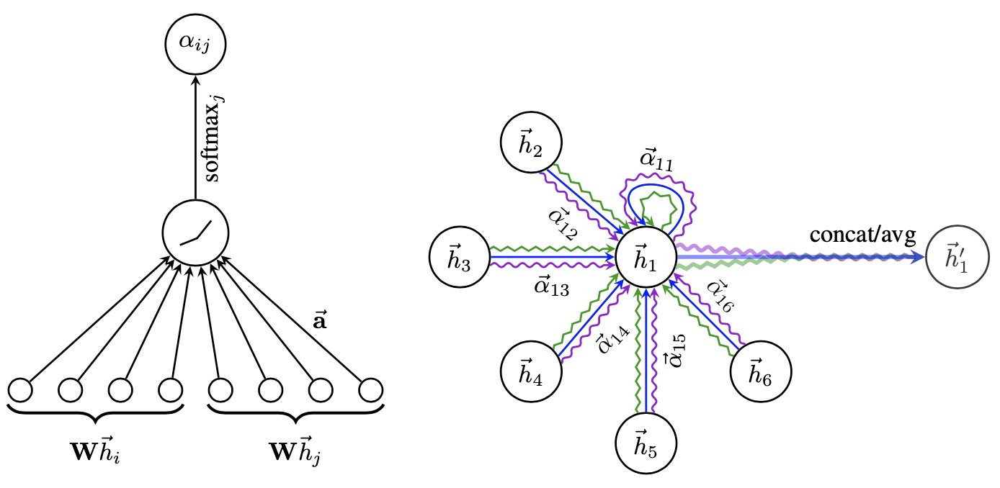

# GraphAttentionNetwork


## A framework implementation of Graph Attention Networks :robot:



This package is used for extracting Graph Attention Embeddings and provides a framework for a Tensorflow Graph Attention Layer which can be used for knowledge graph /node base semantic tasks. It determines the pair wise embedding matrix for a higher order node representation and concatenates them with an attention weight. It then passes it through a leakyrelu activation for importance sampling and damps out negative effect of a node.It then applies a softmax layer for normalization of the attention results and determines the final output scores.The GraphAttentionBase.py script implements a Tensorflow/Keras Layer for the GAT which can be used and the GraphMultiheadAttention.py is used to extract GAT embeddings.

This is a TensorFlow 2 implementation of Graph Attention Networks for generating node embeddings for Knowledge Graphs as well as for implementing a keras layer for Multihead Graph Attention from the paper, [Graph Attention Networks (Veličković et al., ICLR 2018)](https://arxiv.org/abs/1710.10903).


## Dependencies

<a href="https://www.tensorflow.org/">Tensorflow</a>


<a href="https://networkx.org/">Networkx</a>


<a href="https://scipy.org/">scipy</a>


<a href="https://scikit-learn.org/stable/">sklearn</a>


## Usability

Installation is carried out using the pip command as follows:

```python
pip install GraphAttentionNetworks==0.1
```

This library is built with Tensorflow:


The steps for generating Graph Attention Embeddings requires import of [GraphMultiheadAttention.py](https://github.com/abhilash1910/GraphAttentionNetworks/blob/master/GraphAttentionNetworks/GraphMultiheadAttention.py) script. An example is shown in the [test_Script.py](https://github.com/abhilash1910/GraphAttentionNetworks/blob/master/test_script.py)

Create a function to read the input csv file. The input should contain atleast 2 columns - source and target(labels). And both should be in text format. These can include textual extracts and their corresponding labels. The graph is then created as a MultiDigraph from [networkx] with the target and source columns from the input csv file. While generating the embeddings, the extracts from the labels are also considered and can be used to determine which label is the closest to the provided source(input text). In the example below, the 'test_gat_embeddings' method shows this. The dataset chosen for this demonstration is [Google Quest QnA](https://www.kaggle.com/c/google-quest-challenge) and as such any dataset having a source and a label column(textual contents) can be used to generate the embeddings. The  method requires the ```get_gat_embeddings``` method.This method takes as parameters: hidden_units (denotes the hidden embedding dimension of the neural network), num_heads(number of attention heads), epochs (number of training iterations),num_layers(number of layers for the network),mode(defaults to averaging mode attention, for concatenation see ```GraphAttentionBase.py```), the dataframe along with the source and target labels. The model outputs a embedding matrix (no of entries, no of hidden dims) and the corresponding graph.The dimensions are internally reduced to suit the output of the GAT embeddings.


```python
def test_gat_embeddings():
    print("Testing for VanillaGCN embeddings having a source and target label")
    train_df=pd.read_csv("E:\\train_graph\\train.csv")
    source_label='question_body'
    target_label='category'
    print("Input parameters are hidden units , number of layers,subset (values of entries to be considered for embeddings),epochs ")
    hidden_units=32
    num_layers=4
    subset=34
    epochs=40
    num_heads=8
    mode='concat'
    gat_emb,gat_graph=gat.get_gat_embeddings(hidden_units,train_df,source_label,target_label,epochs,num_layers,num_heads,mode,subset)
    print(gat_emb.shape)
    return gat_emb,gat_graph

```

### Theory

- Neural GCN Multiplication: In order to obtain sufficient expressive power to transform the input features into higher level features, atleast one learnable linear transformation is required. To that end, as an initial step, a shared linear transformation, parametrized by a weight matrix, W∈RF'×F , is applied to every node.

`$z_i^{(l)}&=W^{(l)}h_i^{(l)}$`

- Self-Attention Pointwise: We then compute a pair-wise un-normalized attention score between two neighbors. Here, it first concatenates the z embeddings of the two nodes, where || denotes concatenation, then takes a dot product of it with a learnable weight vector  and applies a LeakyReLU in the end. This form of attention is usually called additive attention, in contrast with the dot-product attention used for the Transformer model. We then perform self-attention on the nodes, a shared attentional mechanism a : RF'×RF'→R to compute attention coefficients 
`\begin{split}\begin{align}
e_{ij}^{(l)}&=\text{LeakyReLU}(\vec a^{(l)^T}(z_i^{(l)}||z_j^{(l)}))\\
\end{align}\end{split}`

- 


## Contributing

Pull requests are welcome. For major changes, please open an issue first to discuss what you would like to change.

## License

MIT
